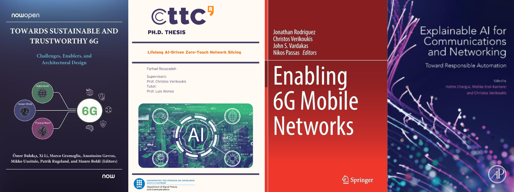

Dr. Farhad Rezazadeh received the Ph.D. degree (<em>Excellent Cum Laude</em>) in
<a href="https://tsc.upc.edu/en" target="_blank" rel="noopener noreferrer">Signal Theory and Communications</a>
from <a href="https://www.upc.edu/ca" target="_blank" rel="noopener noreferrer">Technical University of Catalonia (UPC)</a>,
Barcelona, Spain. He is Founder and Coordinator of the <a href="https://www.acm.org/special-interest-groups/eigs" target="_blank" rel="noopener noreferrer">ACM Emerging Interest Group on Trustworthy and Responsible Systems (EIGTRUST)</a> and the <a href="https://iot.ieee.org/working-groups.html" target="_blank" rel="noopener noreferrer">IEEE TRUST-IoT working group</a>. He is an Applied AI and Generative AI professional with 10+ years of experience building and deploying
real-world AI solutions across TelecomTech, TravelTech, and BioTech. His work spans end-to-end product development—from
problem framing and model development to deployment and measurable business impact—with a focus on translating advanced AI
into reliable, scalable systems. He is currently a <em>Machine Learning Scientist</em> in the Product and Growth department at
<a href="https://www.hostelworldgroup.com/" target="_blank" rel="noopener noreferrer">Hostelworld Group</a>.
Prior to his current role, he was a <em>Visiting Associate Professor</em> at UPC and a Researcher (<em>Senior Applied AI Engineer</em>)
in the <a href="https://www.cttc.cat/services-as-networks-sas/" target="_blank" rel="noopener noreferrer">Services as NetworkS (SaS) Research Unit</a>
at the <a href="https://www.cttc.cat/" target="_blank" rel="noopener noreferrer">Telecommunications Technological Center of Catalonia (CTTC)</a>,
Barcelona, Spain. He also contributed as a Research Assistant at the
<a href="https://ccaba.upc.edu/en" target="_blank" rel="noopener noreferrer">Advanced Broadband Communications Center (CCABA)</a>,
under the guidance of Prof. Josep Solé-Pareta.

He has technical and leadership experience in ten European and national R&amp;D, industrial, and business projects focusing on applied AI.
His <a href="https://innovation-radar.ec.europa.eu/innovation/52337" target="_blank" rel="noopener noreferrer">AI innovation</a>
in B5G/6G resource allocation was recognized by the European Commission’s Innovation Radar and resulted in two EU project patents.
His international experience includes roles at
<a href="https://www.neclab.eu/research-areas/6g-networks" target="_blank" rel="noopener noreferrer">NEC Lab Europe</a>
(under the supervision of Prof. Xavier Costa-Pérez) and scientific missions at
<a href="https://www.ce.cit.tum.de/en/lkn/home/" target="_blank" rel="noopener noreferrer">Technical University of Munich (TUM)</a>,
<a href="https://www.tuhh.de/tuhh/en/startpage" target="_blank" rel="noopener noreferrer">Hamburg University of Technology (TUHH)</a>,
and <a href="https://bcds.udg.edu/news" target="_blank" rel="noopener noreferrer">Universitat de Girona (UdG)</a>.
He was a <a href="https://www.5gstepfwd.eu/#home" target="_blank" rel="noopener noreferrer">Marie Skłodowska-Curie Ph.D.</a> fellow and won five different IEEE/IEEE ComSoc grants,
two <a href="https://www.cost.eu/" target="_blank" rel="noopener noreferrer">European Cooperation in Science and Technology (COST)</a> grants,
and a <a href="https://agaur.gencat.cat/ca/inici/" target="_blank" rel="noopener noreferrer">Catalan Government Ph.D.</a> grant.

As an active member of ACM and IEEE, he has contributed 33+ publications and three books and completed 295+ peer reviews.
He is actively serves as Speaker, Organizer, Chair, Reviewer, and TPC member in IEEE, as well as Guest Editor in Elsevier.
He is an expert in Applied XAI and Generative AI, working on pre-training, fine-tuning, aligning, and deploying large language models (LLMs) and foundation models
for applications such as code generation, drug discovery, telecom, content processing, simulation automation, time series, business recommendation systems,
and decision-making tasks. He recently introduced <em>Digital Co-Founders</em> as a conceptual paradigm that positions Agentic AI systems as autonomous partners
enabling individuals to ideate, build, and scale viable solo businesses.

Research Interests
======
- **Applied AI** [eXplainable AI, Neuro-Symbolic AI, Genertaive AI (Generative RL, Multi-Agent LLM),  Quantum AI (Quantum RL), Graph Neural Network (GNN-RL), Lifelong RL (Multi-agent, Federated, Distributed, Meta Learning), Mixture of Experts (MoEs), and Reservoir Computing (RC) - Echo State Network (ESN)]
- **Large Language Models (LLMs):** Advancing LLMs through fine-tuning, RAG, alignment, and model optimization for specialized tasks, including simulation automation, content generation, and decision-making. Investigating alignment techniques to ensure LLM outputs are aligned with user intent, ethical considerations, and domain-specific requirements.
- **MLOps (CI/CD):** Designing and implementing end-to-end MLOps pipelines using Azure Machine Learning, Azure DevOps, CI/CD workflows, model monitoring, and optimization.
- **Data Science and Data Engineering:** Azure Databricks, Data Lake, Data Factory, and Delta Lake for building scalable data pipelines and Lakehouse architectures and leveraging Azure's ecosystem for advanced analytics and end-to-end AI/ML solutions.
- **5G/6G** [Open 5G/6G, Zero-Touch, Softwarization, Cloudification, Wireless Communications, Massive Network Slicing, 6G Verticals and Services, MEC, O-RAN-xAPPs, and Smart Grid]

News
======
- [Nov. 23, 2024] Invited as Reviewer for Artificial Intelligence | Springer Nature, 2024.
- [Nov. 21, 2024] I delivered a talk at the IEEE Future Networks AIML event, presenting on "Trustworthy AI/ML in 6G Networks through Explainable Reasoning", 2024.
- [Oct. 29, 2024] Invited as TPC member of The Twenty-Fourth International Conference on Networks (ICN), 2025.
- [Oct. 14, 2024] Invited as Reviewer Committee Members for the 3rd International Conference on Intelligent Computing and Next Generation Networks (ICNGN), 2024.
- [Oct. 09, 2024] Invited as Reviewer for Computers Journal, 2024.
- [Oct. 04, 2024] Invited as Reviewer for Computational Economics Journal, 2024.
- [Oct. 02, 2024] Invited as Reviewer for Electronics Journal, 2024.
- [Oct. 01, 2024] Invited as Reviewer for Future Internet Journal, 2024.
- [Sep. 21, 2024] Invited as Speaker for the IEEE Future Networks AIML, 2024.
- [Sep 20, 2024] Our journal paper, entitled 'Toward Explainable Reasoning in 6G: A Proof of Concept Study on Radio Resource Allocation', has been accepted at IEEE Open Journal of the Communications Society.
- [Sep 20, 2024] Our demo paper, entitled 'GenOnet: Generative Open xG Network Simulation with Multi-Agent LLM and ns-3', has been accepted at 3rd International Conference on 6G Networking (6GNet 2024).
- [Sep 16, 2024] Invited as Reviewer for IEEE Transactions on Intelligent Transportation Systems, 2024.
- [Sep 06, 2024] Invited as Reviewer for Entropy Journal, 2024.
- [Aug 23, 2024] Invited as Reviewer for Journal of Infrastructure, Policy and Development, 2024.
- [Aug 12, 2024] Invited as TPC member of International Conference on Computer Sciences, Engineering, and Technology Innovation (ICoCSETI), 2025.
- [Aug 08, 2024] Invited as TPC member of 34th International Conference on Computer Communications and Networks (IEEE-ICCCN 2025), 2024.
- [July 20, 2024] Invited as Reviewer of Computational Economics Journal, 2024.
- [July 09, 2024] Invited as Program Committee Member of International Symposium on Parallel Computing and Distributed Systems (IEEE-PCDS2024), 2024.
- [June 25, 2024] Our paper, entitled 'Intelligible Protocol Learning for Resource Allocation in 6G O-RAN Slicing', has been accepted at IEEE Wireless Communications.
- [June 21, 2024] Invited as Reviewer of Physical Communication Journal, 2024.
- [June 04, 2024] Invited as Reviewer of IEEE Transactions on Artificial Intelligence, 2024.
- [June 01, 2024] Invited as Reviewer of IEEE Open Journal of the Communications Society, 2024.
- [May 07, 2024] Invited as TPC member of 2nd International Conference on AI-generated Content (AIGC 2024), 2024.
- [Apr 17, 2024] Invited as a book reviewer in the Neuro-symbolic AI area for Wiley-IEEE Press, 2024.
- [Feb 26-28, 2024] Presented live demo on 'Explainable Graph Reinforcement Learning' at Mobile world Congress (MWC), 2024.
- [Feb 26, 2024] Invited as TPC member of 2nd International Conference on Sustainable Computing and Smart Systems (ICSCSS 2024), 2024.
- [Feb 22, 2024] Our paper, entitled 'A Novel Approach for Scalable and Sustainable 6G Networks', has been accepted at IEEE Open Journal of the Communications Society.
- [Feb 12, 2024] Our workshop proposal, entitled 'Explainable and Responsible AI/GenAI for 6G Networks (6GBRAIN)', has been accepted at IEEE Meditcom 2024.
- [Feb 04, 2024] Our paper, entitled 'Decentralized Energy Marketplace via NFTs and AI-based Agents,' has been accepted for presentation at IEEE ENERGYCON 2024.
- [Jan 18, 2024] Invited as TPC member of 2024 EuCNC & 6G Summit, 2024.
- [Dec 28, 2023] Invited Speaker at 3rd International Forum on Electronics and Electrical Engineering, 2024.
- [Dec 20, 2023] Awarded IEEE ComSoc Student Grant for 2023 IEEE NFV-SDN.
- [Oct 20, 2023] Our AI innovation in B5G/6G resource allocation was recognized as a great EU-funded Innovation by the European Commission's Innovation Radar. [[Access Link](https://innovation-radar.ec.europa.eu/innovation/52337)]

  

